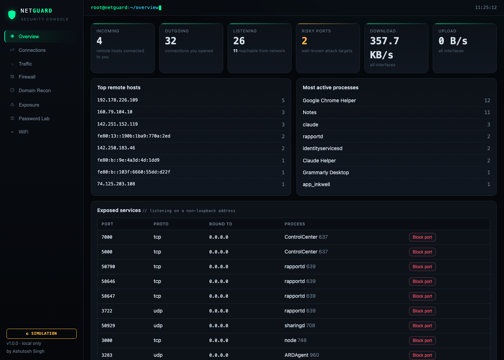
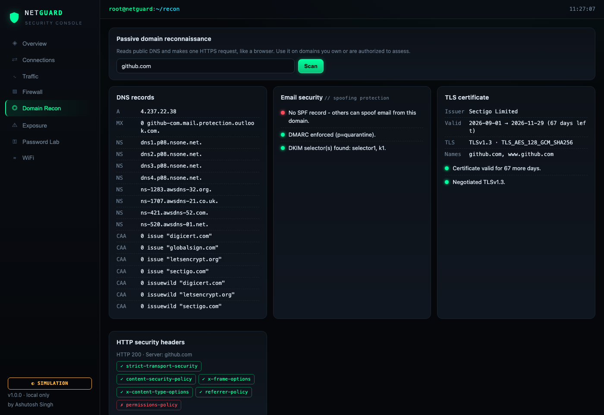
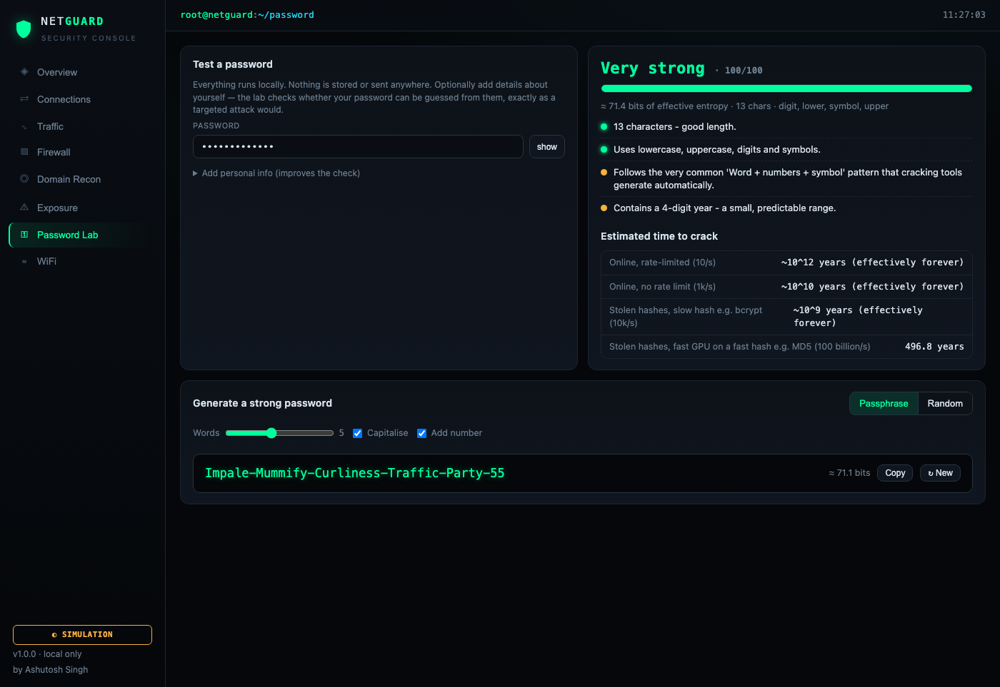

# NetGuard: Network Monitor & Firewall Dashboard

**See what traffic is coming into and going out of your computer, and block it, from a local web dashboard.**

NetGuard is a hands-on learning tool for **cyber-security students**. It shows the network activity on your own machine, lets you block IP addresses and services with your operating system's firewall, runs passive reconnaissance on any domain, audits whether your traffic could leak credentials, and teaches password strength — all from one dark "security operations centre" dashboard. Every firewall command it runs is displayed, so you can see how the rules work underneath.

> Built by **Ashutosh Singh**. Runs 100% locally on Windows, macOS and Linux. No cloud, no telemetry, no packet capture.



---

## Features

| Tab | What you get |
|-----|--------------|
| **Overview** | Counts of incoming, outgoing and listening connections, live download/upload speed, the top remote hosts and most active processes, and a list of **exposed services** (ports reachable from your network). |
| **Connections** | Every TCP/UDP socket on the machine, labelled **incoming / outgoing / listening**, with the local and remote address, state and **owning process + PID**. Public IPs and **risky ports** (Telnet, SMB, RDP, 4444…) are tagged. One-click **Block IP** / **Block port** buttons. |
| **Traffic** | A live throughput chart for the last 2 minutes, plus per-interface rates, total bytes, errors and dropped packets. |
| **Firewall** | Block an **IP address**, a **CIDR network** (`10.0.0.0/24`) or a **port/service**, inbound, outbound or both, TCP/UDP. The exact `iptables` / `pfctl` / `netsh` commands are shown for every rule. Unblock one rule or all of them. |
| **Domain Recon** | Passive reconnaissance on any domain: **DNS records** (A, AAAA, MX, NS, TXT, CAA), **email-spoofing protection** (SPF / DMARC / DKIM), the **TLS certificate** (issuer, validity, days remaining, TLS version, the names it covers) and which **HTTP security headers** the site sets. Reads only public data. |
| **Exposure** | Answers *"could my network activity leak my passwords?"* by flagging connections on **cleartext protocols** (HTTP, FTP, Telnet, IMAP…) and **open WiFi**, where credentials can be read by others. Gives a safety score and concrete fixes. It never reads any password — only the channels traffic uses. |
| **Password Lab** | Test a password's strength offline: length, character variety, an **entropy estimate**, whether it is a known leaked password, and whether it is built from **your own personal details** (name, date of birth, pet…) — the way a targeted attacker would guess. Shows an estimated **time to crack** for four attacker types, and **generates strong passwords** (diceware passphrases or random). Nothing is stored or sent anywhere. |
| **WiFi** | Nearby WiFi networks with signal strength, channel and security (Open / WEP / WPA / WPA2 / WPA3). Open and WEP networks are highlighted. |




### Safe by design
- **Simulation mode** by default. If you don't run it as root or Administrator, rules are recorded and their commands are shown, but **nothing on your system changes**, so you can explore safely.
- **Lock-out protection.** It refuses to block loopback (`127.0.0.1`, `::1`), `0.0.0.0/0`, or the port the dashboard itself runs on.
- **Only touches its own rules.** Rules are tagged (`netguard:<id>` in iptables, the `com.apple/netguard` pf anchor, `NetGuard-<id>` in Windows Firewall). Your existing firewall configuration is never edited.
- **Hardened local web app.** It binds to `127.0.0.1` only. A per-session API token blocks CSRF, a Host-header check blocks DNS rebinding, and it sends a strict Content-Security-Policy. All input is validated, and commands run without a shell, so command injection isn't possible.

---

## Quick start

**Requirements:** Python 3.9+ and `pip`.

```bash
git clone https://github.com/amanashu01/wifi-scanner.git netguard
cd netguard
```

### macOS / Linux
```bash
./run.sh            # simulation mode: safe, shows commands only
sudo ./run.sh       # live mode: really applies firewall rules
```

### Windows (PowerShell or CMD)
```bat
run.bat             :: simulation mode
```
To use live mode, right-click **Command Prompt → Run as administrator**, then run `run.bat`.

Then open **http://127.0.0.1:5050** in your browser.

<details>
<summary>Manual setup (without the scripts)</summary>

```bash
python3 -m venv .venv
source .venv/bin/activate          # Windows: .venv\Scripts\activate
pip install -r requirements.txt
python app.py                      # or: sudo .venv/bin/python app.py
```
</details>

### Command-line options
```
python app.py [--port 5050] [--host 127.0.0.1] [--flush] [--debug]

  --port    port for the dashboard (default 5050; macOS AirPlay already uses 5000)
  --host    interface to bind. Keep 127.0.0.1 unless you are in an isolated lab
  --flush   remove every NetGuard firewall rule and exit
```

> **Finished experimenting?** Click **Firewall → Remove all**, or run `sudo python app.py --flush`.

---

## How to use it

Once the dashboard is open at **http://127.0.0.1:5050**, work through the tabs in the left sidebar. The badge in the bottom-left shows **SIMULATION** (safe, default) or **LIVE** (running as root/Administrator).

### 1. Overview — get the lay of the land
Start here. It answers "what is my machine doing on the network right now?"
- Read the six tiles: how many connections are **incoming**, **outgoing** and **listening**, your live **download/upload** speed, and how many **risky ports** are in use.
- Scan **Exposed services** at the bottom — anything listening on `0.0.0.0` is reachable from your network. If you don't recognise one, that's your first thing to investigate. Click **Block port** to close it (see Firewall).

### 2. Connections — see every conversation
- Use the **All / Incoming / Outgoing / Listening** buttons to filter, or type in the search box (an IP, a port, or a program name).
- Each row shows the program and PID that owns the socket. A **public** tag means the other end is on the internet; a ⚠ **risky** tag means a well-known attack port.
- Click **Block IP** next to a suspicious remote host, or **Block port** next to a listening service, to firewall it instantly.
- Leave **live** ticked to watch it refresh; untick **hide loopback** to also see internal-only sockets.

### 3. Traffic — watch bandwidth in real time
- The chart plots download (blue) and upload (green) over the last 2 minutes. Start a download and watch it climb.
- The table breaks it down per network card, including **errors** and **dropped** packets — rising numbers there point to a bad link or a flood.

### 4. Firewall — block IPs and services
- Pick **Type** = *IP / network* or *Port (service)*, fill in the **Target** (`203.0.113.7`, `10.0.0.0/24`, or a port like `3389`), choose the **Direction**, add an optional note, and click **Block**.
- Every rule lists the exact `iptables` / `pfctl` / `netsh` command it uses — expand **Firewall commands** to learn the syntax.
- In **simulation mode** the rule is only recorded and shown; in **live mode** it is applied immediately. Remove one rule with **Unblock**, or clear everything with **Remove all**.
- NetGuard refuses to block loopback, `0.0.0.0/0`, or its own port, so you can't lock yourself out.

### 5. Domain Recon — investigate a domain
- Type a domain you own or are authorized to assess (e.g. `example.com`) and click **Scan**.
- Read the four cards: **DNS records**; **email security** (green means SPF/DMARC/DKIM protect the domain from spoofing, red means it can be impersonated); the **TLS certificate** (check the *days left* before it expires); and the **HTTP security headers** the site sets (green ✓) or is missing (red ✗).

### 6. Exposure — could my traffic leak my passwords?
- Click **Re-check**. NetGuard reads your live connections (never any password) and gives a **safety score**.
- Each finding names the risk (e.g. an HTTP or Telnet connection, or being on open WiFi) and, after the **→**, exactly what to do about it. A high score with all-green means no obvious cleartext credential exposure.

### 7. Password Lab — test and build passwords
- Type a password in **Test a password** (it never leaves your machine). The verdict, strength bar, entropy and **time to crack** update as you type.
- Open **Add personal info** and fill in your name, date of birth, pet, etc. If your password is built from any of them, the score drops sharply and the lab tells you which detail it found — this is how a targeted attacker guesses.
- Use **Generate a strong password** to create a **passphrase** (easy to remember) or a **random** string. Adjust the sliders, then **Copy**.

### 8. WiFi — audit nearby networks
- Click **Rescan now** to list nearby WiFi. **Open** and **WEP** networks are flagged in red — avoid entering passwords on them without a VPN.

> **Tip:** most tabs need no privileges, but to see *every* program's connections and to actually enforce firewall rules, start NetGuard with `sudo ./run.sh` (macOS/Linux) or an Administrator prompt (Windows).

---

## How it works

```
 Browser (static/app.js)                   Flask (app.py)                 Operating system
 ───────────────────────                   ──────────────                 ────────────────
 Overview / Connections  ── GET /api/connections ──► netguard/connections.py ─► psutil / lsof  (socket table)
 Traffic chart           ── GET /api/traffic     ──► netguard/traffic.py     ─► interface byte counters
 WiFi                    ── GET /api/wifi        ──► netguard/wifi.py        ─► netsh / nmcli / system_profiler
 Domain Recon            ── GET /api/recon       ──► netguard/recon.py       ─► public DNS + one HTTPS request
 Exposure                ── GET /api/exposure    ──► netguard/exposure.py    ─► reasons over live connections
 Password Lab            ── POST /api/password/* ──► netguard/password.py    ─► offline, word lists in netguard/data
 Firewall                ── POST/DELETE /api/firewall/rules
                             (X-NetGuard-Token)  ──► netguard/firewall.py    ─► iptables / pfctl / netsh
```

All endpoints are JSON. The read-only monitoring routes (`/api/connections`, `/api/traffic`, `/api/wifi`, `/api/recon`, `/api/exposure`) are plain `GET`s; anything that changes state or accepts a password (`/api/firewall/rules`, `/api/password/*`) is a `POST`/`DELETE` that requires the per-session `X-NetGuard-Token` header.

### How is a connection classified?
The OS keeps a table of every open socket. NetGuard reads it (the same data `netstat -an` or `lsof -i` prints) and labels each one:

| Label | Rule | Example |
|-------|------|---------|
| **listening** | socket in `LISTEN` state (or a UDP socket with no peer) | a web server waiting on `:80` |
| **incoming** | established, and our local port is one we listen on, so *they* connected to *us* | someone SSH-ing into your `:22` |
| **outgoing** | any other established connection, so *we* connected to *them* | your browser talking to `142.250.x.x:443` |

A listening socket bound to `0.0.0.0` or `::` is **exposed**, meaning other machines on the network can reach it. One bound to `127.0.0.1` is only reachable from your own computer.

### How is bandwidth measured?
The kernel counts the bytes sent and received on every interface. NetGuard reads those counters every 2 seconds and divides the change by the elapsed time: `rate = Δbytes / Δt`. No packets are captured.

### What does a block rule look like?

| OS | Firewall | Blocking inbound traffic from `203.0.113.7` |
|----|----------|--------------------------------|
| Linux | iptables | `iptables -I INPUT -s 203.0.113.7 -m comment --comment netguard:ab12cd34 -j DROP` |
| macOS | pf | `block drop in quick from 203.0.113.7 to any` (loaded into anchor `com.apple/netguard`) |
| Windows | Defender Firewall | `netsh advfirewall firewall add rule name=NetGuard-ab12cd34 action=block dir=in remoteip=203.0.113.7` |

Blocking a **port** stops the service listening on it from being reached. For example, blocking port `3389` blocks inbound RDP.

---

## Try these exercises

1. **Spot your own server.** Run `python3 -m http.server 8000` in another terminal. It shows up as an **exposed** listening service. Open `http://<your-LAN-IP>:8000` from your phone and watch an **incoming** connection appear.
2. **Block it.** Click **Block port** next to `8000` (in live mode). Reload the page on your phone and it will time out. Unblock it, and it works again.
3. **Who is your browser talking to?** Filter Connections by your browser's name and count the **public** IPs. Run `whois <ip>` on a few of them.
4. **Audit exposed services.** Check the Overview for any listening port marked ⚠ risky. Do you know why each one is open?
5. **Read the rules.** Add a rule in simulation mode, open **Firewall commands**, and run the same command yourself to learn the syntax.
6. **Watch a download.** Start a large download and watch the Traffic chart and the per-interface counters.

More background is in [docs/LEARNING.md](docs/LEARNING.md).

---

## Platform notes

| | Connections | Firewall | WiFi |
|---|---|---|---|
| **Linux** | psutil (run with `sudo` to see other users' processes) | `iptables` / `ip6tables` | `nmcli` (NetworkManager) |
| **macOS** | psutil if root, otherwise `lsof` (your own processes only) | `pf` via anchor `com.apple/netguard` | `system_profiler` (BSSID not exposed by macOS) |
| **Windows** | psutil | `netsh advfirewall` | `netsh wlan` |

- **Linux with nftables only:** most distros ship `iptables-nft`, which works transparently. If `iptables` is missing, install the `iptables` package.
- **Rules after a reboot:** OS firewall rules are usually cleared on reboot. NetGuard saves your rules in `data/rules.json` and re-applies them the next time you start it in live mode.
- **macOS WiFi names:** recent macOS versions may hide SSIDs unless the terminal has Location Services permission.

## Troubleshooting

| Problem | Fix |
|---------|-----|
| "Showing only your own processes" | Run with `sudo` (macOS/Linux) or as Administrator (Windows). |
| Port 5050 already in use | `python app.py --port 8080` |
| Rule shows **error** / "command failed" | Check that you are root/Administrator and that `iptables` / `pfctl` / `netsh` exists. |
| Lost connectivity after an experiment | `sudo python app.py --flush`. On macOS you can also run `sudo pfctl -a com.apple/netguard -F rules`. |
| No WiFi networks | Make sure WiFi is on. On macOS, grant Location Services to your terminal. On Linux, install NetworkManager. |

## Project layout

```
app.py                    Flask app: routes, security guards, CLI
netguard/
  connections.py          socket table → incoming / outgoing / listening + risk hints
  traffic.py              per-interface byte counters → live rates
  firewall.py             rule validation + iptables / pf / netsh backends
  wifi.py                 nearby WiFi networks (per-OS parsers)
  recon.py                passive domain recon: DNS, email security, TLS cert, HTTP headers
  exposure.py             cleartext-credential & open-WiFi exposure audit
  password.py             password strength analysis + generator (offline)
  data/                   EFF diceware + common-password word lists
templates/index.html      dashboard markup
static/app.js, style.css  dashboard logic & styles (no external libraries)
tests/                    pytest suite
docs/LEARNING.md          background concepts for learners
docs/screenshots/         images used in this README
run.sh / run.bat          one-command setup & launch
```

## Dependencies

Installed automatically by `run.sh` / `run.bat` from `requirements.txt`:

- **flask** — the local web server
- **psutil** — cross-platform socket table and interface counters
- **dnspython** — DNS lookups for Domain Recon
- **certifi** — a trusted CA bundle so TLS certificates validate even on Python builds that ship without a system CA store

The TLS, HTTP and password features use only the Python standard library beyond these.

## Running the tests

```bash
pip install -r requirements-dev.txt
python -m pytest -q
```

The tests cover input validation, the command generated for each firewall backend (including injection attempts), connection parsing and classification, and the API's security checks. None of them touch your real firewall.

## ⚠️ Legal & ethical use

NetGuard is for **learning and for defending machines you own or are authorized to administer**. It inspects only the computer it runs on and never captures other people's traffic. Changing firewall rules can cut off network access, so experiment on a personal machine or a VM, and keep `--flush` handy.

## License

[MIT](LICENSE) © 2026 Ashutosh Singh
